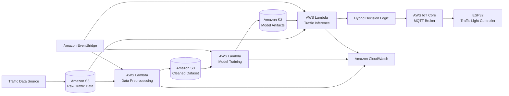

# 🚦 Serverless Smart Traffic Control System

A serverless, machine learning-based traffic control system that dynamically calculates green-light duration based on current traffic conditions.

The system automates traffic-data preprocessing, machine-learning model training, traffic-speed inference, and control-signal delivery to an ESP32 device using AWS serverless services and MQTT communication.

> This project was developed as an academic proof of concept for adaptive traffic control, serverless machine learning, and cloud-to-IoT integration.

---

## 📌 Overview

Conventional traffic lights commonly use fixed timing schedules that may not adapt effectively to changing road conditions.

This project explores an adaptive traffic-control approach that processes traffic data, estimates traffic speed using machine learning, and calculates an appropriate green-light duration for each traffic phase.

The workflow is implemented using AWS serverless services, allowing the data pipeline and inference process to run without managing dedicated servers.

The project focuses on:

- Serverless architecture
- Event-driven data processing
- Machine-learning deployment
- Cloud monitoring
- AWS service integration
- MQTT-based IoT communication
- Cost-aware model selection

---

## ✨ Key Features

- Automated traffic-data preprocessing from Amazon S3
- Serverless model training using AWS Lambda
- Linear Regression and Random Forest model experimentation
- Event-driven, near-real-time traffic inference
- Hybrid decision logic using observed and predicted traffic speed
- Dynamic green-light duration calculation
- MQTT communication through AWS IoT Core
- Control-signal delivery to an ESP32 device
- Model artifact storage in Amazon S3
- Scheduled workflow execution using Amazon EventBridge
- Application logging and monitoring using Amazon CloudWatch

---

## 🏗️ System Architecture



---

## 🔄 System Workflow

### 1. Traffic Data Collection

Traffic information is collected from an external traffic-data source and stored as CSV files in Amazon S3.

The traffic records contain information such as:

- Observation timestamp
- Traffic-light phase
- Route distance
- Normal travel duration
- Traffic-adjusted travel duration
- Observed traffic speed

---

### 2. Data Preprocessing

The preprocessing Lambda function reads raw CSV files from Amazon S3 and prepares them for model training.

The preprocessing process includes:

- Reading CSV files from Amazon S3
- Combining multiple traffic-data files
- Selecting the required columns
- Converting values into appropriate data types
- Removing incomplete or invalid records
- Filtering non-positive traffic measurements
- Sorting records by timestamp
- Saving the cleaned dataset back to Amazon S3

---

### 3. Model Training

The cleaned traffic dataset is used to train two regression models:

- Linear Regression
- Random Forest Regression

Each model is evaluated using regression metrics such as:

- Mean Absolute Error
- Mean Squared Error
- Root Mean Squared Error
- Coefficient of Determination

The generated model artifacts are stored in Amazon S3 for later use by the inference function.

---

### 4. Model Selection

Both Linear Regression and Random Forest were evaluated during model development.

Linear Regression was selected for the primary serverless inference workflow because it provides:

- A smaller model artifact
- Simple JSON-based serialization
- Lower dependency requirements
- Faster model loading
- Lower deployment-package complexity
- Lightweight inference execution

Random Forest is retained as an experimental comparison model and is not currently used by the main inference function.

This decision represents an engineering trade-off between model complexity, artifact size, execution latency, and serverless deployment efficiency.

---

### 5. Traffic Inference

The inference Lambda function performs the following process:

1. Retrieves the latest traffic data from Amazon S3
2. Loads the selected machine-learning model
3. Generates a predicted traffic-speed value
4. Reads the latest observed traffic speed
5. Combines the observed and predicted values
6. Calculates an adaptive green-light duration
7. Publishes the traffic-light decision through AWS IoT Core

The system uses an event-driven, near-real-time workflow rather than continuous data streaming.

---

### 6. IoT Traffic-Light Control

The calculated traffic-light decision is published to an MQTT topic through AWS IoT Core.

An ESP32 device subscribes to the MQTT topic and receives the control message. The device then applies the calculated duration to the corresponding traffic-light phase.

---

## 🧠 Machine-Learning Pipeline

### Input Features

| Feature | Description |
|---|---|
| `distance_m` | Estimated route distance in meters |
| `duration_s` | Estimated normal travel duration in seconds |
| `duration_in_traffic_s` | Estimated travel duration under current traffic conditions |

### Prediction Target

| Target | Description |
|---|---|
| `speed_kmh` | Estimated traffic speed in kilometers per hour |

### Models

| Model | Purpose | Deployment Status |
|---|---|---|
| Linear Regression | Lightweight traffic-speed estimation | Used for inference |
| Random Forest Regression | Experimental model comparison | Training and evaluation only |

---

## ⚙️ Hybrid Decision Logic

The traffic-control decision does not depend entirely on a machine-learning prediction.

Instead, the system combines:

- The latest observed traffic speed
- The speed predicted by the machine-learning model

The combined result is used to calculate an adaptive green-light duration.

Conceptually:

```text
Hybrid Speed = Combination of Observed Speed and Predicted Speed
```

```text
Green Duration = Base Green Duration × Reference Speed / Hybrid Speed
```

Minimum and maximum duration limits are used to prevent unrealistic traffic-light timing.

The base duration, reference speed, hybrid weighting values, and duration limits can be adjusted based on experimental results and traffic-engineering requirements.

---

## 📁 Project Structure

```text
smart-traffic-ml/
├── preprocessing/
│   └── cleaning.py
│
├── training/
│   ├── train_linear_regression.py
│   └── train_random_forest.py
│
├── inference/
│   └── inference.py
│
├── requirements.txt
└── README.md
```

### Directory Description

| Directory | Description |
|---|---|
| `preprocessing/` | Reads, validates, cleans, and stores traffic data |
| `training/` | Trains and evaluates Linear Regression and Random Forest models |
| `inference/` | Loads the selected model, calculates traffic decisions, and publishes MQTT messages |

---

## 🛠️ Technology Stack

### Programming and Machine Learning

- Python
- Pandas
- NumPy
- Scikit-learn
- Joblib

### AWS Services

- AWS Lambda
- Amazon S3
- AWS IoT Core
- Amazon EventBridge
- Amazon CloudWatch
- AWS Identity and Access Management

### IoT and Communication

- ESP32
- MQTT

---

## ☁️ AWS Service Responsibilities

| AWS Service | Responsibility |
|---|---|
| Amazon S3 | Stores raw datasets, cleaned datasets, and model artifacts |
| AWS Lambda | Runs preprocessing, model training, and inference functions |
| Amazon EventBridge | Schedules automated workflow execution |
| AWS IoT Core | Publishes traffic-control messages through MQTT |
| Amazon CloudWatch | Stores execution logs and monitors Lambda functions |
| AWS IAM | Controls access between AWS services |

---

## 📄 Expected Input Data

The traffic dataset is expected to contain fields similar to the following:

```csv
timestamp_utc,phase,distance_m,duration_s,duration_in_traffic_s,speed_kmh
2026-01-01T08:00:00Z,1,1200,180,240,18.0
2026-01-01T08:00:00Z,2,950,140,210,16.3
```

### Required Fields

| Field | Description |
|---|---|
| `timestamp_utc` | Timestamp of the traffic observation |
| `phase` | Traffic-light phase identifier |
| `distance_m` | Route distance in meters |
| `duration_s` | Normal travel duration in seconds |
| `duration_in_traffic_s` | Traffic-adjusted travel duration in seconds |
| `speed_kmh` | Observed traffic speed in kilometers per hour |

---

## 🔐 Configuration

The Lambda functions require environment-specific configuration, including:

- Raw-data S3 bucket
- Raw-data object prefix
- Cleaned-data S3 bucket
- Cleaned-data object key
- Model-artifact S3 bucket
- Model-artifact object key
- Latest traffic-data prefix
- AWS IoT MQTT topic
- Base green-light duration
- Reference traffic speed
- Minimum green-light duration
- Maximum green-light duration

Sensitive information must not be stored directly in this repository.

Do not commit:

- AWS access keys
- AWS secret access keys
- External API keys
- IoT private keys
- IoT certificates
- Local environment files
- Private AWS account information

Use IAM roles, Lambda environment variables, and secure AWS configuration instead.

---

## 🚀 Local Setup

### Prerequisites

Ensure that the following tools are installed:

- Python 3.10 or later
- Git
- AWS CLI
- An AWS account
- Access to the required Amazon S3 buckets
- Access to AWS IoT Core

### Clone the Repository

```bash
git clone https://github.com/nraditya/smart-traffic-ml.git
cd smart-traffic-ml
```

### Create a Virtual Environment

#### Linux or macOS

```bash
python3 -m venv .venv
source .venv/bin/activate
```

#### Windows PowerShell

```powershell
python -m venv .venv
.venv\Scripts\Activate.ps1
```

### Install Dependencies

```bash
pip install --upgrade pip
pip install -r requirements.txt
```

---

## ✅ Code Validation

Before packaging or deploying the Lambda functions, validate the Python syntax.

### Linux or macOS

```bash
python -m py_compile \
  preprocessing/cleaning.py \
  training/train_linear_regression.py \
  training/train_random_forest.py \
  inference/inference.py
```

### Windows PowerShell

```powershell
python -m py_compile `
  preprocessing/cleaning.py `
  training/train_linear_regression.py `
  training/train_random_forest.py `
  inference/inference.py
```

---

## 📦 Deployment Overview

This repository currently contains the core application code for the preprocessing, training, and inference workflow.

A complete AWS deployment requires the following resources:

1. Amazon S3 storage for:
   - Raw traffic data
   - Cleaned traffic data
   - Machine-learning model artifacts

2. AWS Lambda functions for:
   - Data preprocessing
   - Linear Regression training
   - Random Forest training
   - Traffic inference

3. Lambda environment variables for service configuration

4. IAM roles with least-privilege access to:
   - Read selected S3 objects
   - Write selected S3 objects
   - Publish messages to a specific IoT topic
   - Write logs to CloudWatch

5. EventBridge schedules or Amazon S3 event triggers

6. An AWS IoT Core MQTT topic

7. A registered and authorized ESP32 IoT device

8. CloudWatch logging and monitoring configuration

Python dependencies such as Pandas, NumPy, Scikit-learn, and Joblib may be deployed using:

- Lambda ZIP deployment packages
- AWS Lambda Layers
- Lambda container images

---

## 📈 Monitoring

Amazon CloudWatch can be used to monitor:

- Lambda invocation count
- Lambda execution duration
- Function errors
- Function timeouts
- Memory usage
- Data-preprocessing failures
- Model-training failures
- Model-loading failures
- IoT publishing failures

Application logs may include:

- Processing timestamp
- Processed S3 object key
- Number of valid records
- Model version
- Predicted traffic speed
- Observed traffic speed
- Hybrid traffic speed
- Selected traffic phase
- Calculated green-light duration
- Error information

---

## ⚖️ Engineering Considerations

### Model Artifact Size

A smaller model artifact can reduce:

- Amazon S3 transfer time
- Lambda initialization overhead
- Model-loading latency
- Deployment-package complexity

### Serverless Execution Cost

AWS Lambda cost is influenced by:

- Allocated memory
- Execution duration
- Number of invocations
- Dependency size

### Execution Latency

Inference latency may be affected by:

- Lambda cold starts
- S3 object retrieval
- Model artifact size
- Dependency initialization
- AWS IoT Core publishing latency

### Reliability

The workflow should handle:

- Missing S3 objects
- Empty datasets
- Invalid CSV schemas
- Invalid traffic measurements
- Missing model artifacts
- IoT publishing failures
- Lambda timeout conditions

---

## ⚠️ Limitations

The current implementation has several limitations:

- The system is an academic proof of concept.
- The dataset size and traffic coverage are limited.
- The model has not been validated for direct use on public roads.
- The current features have a strong mathematical relationship with traffic speed.
- Model accuracy should not be interpreted as complete traffic-forecasting capability.
- External factors such as weather, accidents, road geometry, and driver behavior are not included.
- The inference workflow is event-driven and near-real-time rather than continuous streaming.
- Infrastructure-as-code deployment is not currently included in this repository.
- Automated unit and integration tests are not yet included.
- A real traffic-light deployment would require additional safety validation and fail-safe controls.

Because speed is mathematically related to distance and travel duration, the current machine-learning pipeline primarily demonstrates serverless model deployment, automated data processing, and cloud-to-IoT integration.

---

## 🔮 Future Improvements

Potential future improvements include:

- Add vehicle-count data
- Add queue-length measurements
- Add road-occupancy features
- Add weather information
- Add time-of-day and day-of-week features
- Add historical traffic-speed features
- Use chronological train-test splitting
- Add automated unit tests
- Add integration tests
- Add data-schema validation
- Add model-version tracking
- Add dead-letter queues for failed events
- Add automatic retry mechanisms
- Add infrastructure as code using Terraform or AWS SAM
- Add a CI/CD pipeline using GitHub Actions
- Add CloudWatch dashboards and alarms
- Measure end-to-end execution latency
- Compare model accuracy, artifact size, and inference cost
- Add traffic-control fallback timing
- Add a monitoring dashboard for traffic conditions and system decisions

---

## 🎯 Project Focus

This project demonstrates practical experience in:

- Serverless architecture
- Event-driven processing
- Cloud-based machine-learning workflows
- AWS service integration
- Amazon S3 data pipelines
- AWS Lambda development
- MQTT-based IoT communication
- Model deployment trade-offs
- Cloud monitoring and logging
- Cost-aware application design
- Cloud-to-edge device integration

---

## 👤 Author

**Nabil Raditya**

Applied Internet Engineering graduate with interests in cloud infrastructure, serverless architecture, infrastructure automation, and cloud-native systems.

GitHub: [nraditya](https://github.com/nraditya)
